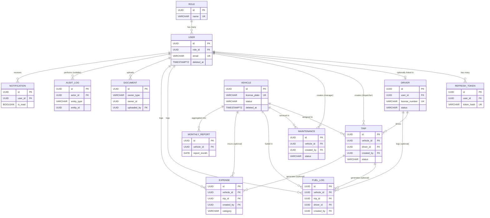

# FleetFlow — Phase 2: Database Design & ER Diagram

**Document Type:** Production Database Design (No SQL)
**Prepared For:** FleetFlow — Modular Fleet & Logistics Management System
**Database Engine:** PostgreSQL
**ORM:** Prisma
**Author Role:** Senior Database Architect
**Status:** Phase 2 Deliverable

---

## 1. Design Principles

Before the table-by-table breakdown, these are the architectural decisions that shape every table below:

1. **UUID Primary Keys** — Every table uses a UUID (v4) primary key rather than an auto-incrementing integer. This avoids ID collisions across environments, prevents enumeration attacks on public-facing IDs (e.g., trip/vehicle references), and simplifies future multi-region or multi-tenant replication.
2. **Soft Deletes on Core Entities** — `User`, `Vehicle`, `Driver`, `Trip`, and `Maintenance` use a nullable `deleted_at` timestamp instead of hard deletes. Fleet and financial records must remain auditable even after a vehicle is retired or a driver leaves — hard-deleting would break historical trip, expense, and report integrity.
3. **Deliberate Denormalization for Analytics** — `MonthlyReport` pre-aggregates figures that could technically be computed live from `Trip`, `FuelLog`, `Expense`, and `Maintenance`. This is intentional: Module 8 (Analytics & Reports) needs sub-2-second response times (NFR requirement) even as trip volume scales past 500+ vehicles. Recomputing ROI and fuel efficiency from raw rows on every dashboard load does not scale; a nightly/monthly materialization job does.
4. **Polymorphic Tables Where Reuse Outweighs Rigidity** — `Document` and `AuditLog` use an `owner_type`/`owner_id` (or `entity_type`/`entity_id`) pattern rather than one join table per entity. This keeps document uploads (license scans, insurance PDFs, invoices) and change history in one place instead of fragmenting them across `VehicleDocument`, `DriverDocument`, `TripDocument`, etc.
5. **No Many-to-Many in Current Scope** — The SRS describes one driver per trip and one vehicle per trip (Rule: "Each Trip references one Vehicle and one Driver"). This is modeled as a direct one-to-many relationship, not a junction table. A future `TripAssignment` junction table is documented in Section 6 as an escalation path for multi-driver or relay trips.
6. **Normalization Level** — The schema is normalized to 3NF for all transactional tables (`Vehicle`, `Driver`, `Trip`, `Maintenance`, `FuelLog`, `Expense`). `MonthlyReport` is the single deliberate exception, denormalized for read performance as explained above.

---

## 2. Table-by-Table Design

### 2.1 `Role`

**Purpose:** Backbone of Role-Based Access Control (RBAC). Defines the four core personas from the SRS (Fleet Manager, Dispatcher, Safety Officer, Financial Analyst) plus room for an Admin role, without hardcoding role logic into application code.

| Column | Data Type | Nullable | Default | Notes |
|---|---|---|---|---|
| id | UUID | No | `gen_random_uuid()` | Primary Key |
| name | VARCHAR(50) | No | — | e.g. `fleet_manager`, `dispatcher`, `safety_officer`, `financial_analyst`, `admin` |
| description | TEXT | Yes | NULL | Human-readable role summary |
| permissions | JSONB | Yes | `'{}'` | Optional fine-grained permission overrides beyond the static role-module matrix |
| created_at | TIMESTAMPTZ | No | `now()` | |
| updated_at | TIMESTAMPTZ | No | `now()` | |

- **Primary Key:** `id`
- **Foreign Keys:** None
- **Unique Constraints:** `name`
- **Indexes:** Unique index on `name` (lookup on login and permission checks)

---

### 2.2 `User`

**Purpose:** Represents every authenticated actor in the system — fleet managers, dispatchers, safety officers, financial analysts, and admins. Drivers are modeled separately (see `Driver`) since not all drivers necessarily log into the web application, but a `Driver` may optionally link back to a `User` account.

| Column | Data Type | Nullable | Default | Notes |
|---|---|---|---|---|
| id | UUID | No | `gen_random_uuid()` | Primary Key |
| role_id | UUID | No | — | FK → `Role.id` |
| full_name | VARCHAR(150) | No | — | |
| email | VARCHAR(255) | No | — | Login identifier |
| password_hash | VARCHAR(255) | No | — | bcrypt/argon2 hash, never plaintext |
| phone | VARCHAR(20) | Yes | NULL | |
| avatar_url | VARCHAR(500) | Yes | NULL | |
| is_active | BOOLEAN | No | `true` | Disables login without deleting the record |
| last_login_at | TIMESTAMPTZ | Yes | NULL | |
| deleted_at | TIMESTAMPTZ | Yes | NULL | Soft delete |
| created_at | TIMESTAMPTZ | No | `now()` | |
| updated_at | TIMESTAMPTZ | No | `now()` | |

- **Primary Key:** `id`
- **Foreign Keys:** `role_id` → `Role.id` (ON DELETE RESTRICT — a role in use cannot be deleted)
- **Unique Constraints:** `email`
- **Indexes:** Unique index on `email`; index on `role_id` (permission filtering); partial index on `deleted_at IS NULL` (active-user queries)

**Why it exists:** Every RBAC check, every audit log entry, and every "created_by"/"uploaded_by" reference in the system traces back to this table. It is the single source of truth for "who did what."

---

### 2.3 `RefreshToken`

**Purpose:** Supports JWT-based authentication with refresh-token rotation, per the SRS security requirement for JWT Authentication. Access tokens stay short-lived and stateless; refresh tokens are tracked server-side so they can be revoked (logout, password change, suspicious activity).

| Column | Data Type | Nullable | Default | Notes |
|---|---|---|---|---|
| id | UUID | No | `gen_random_uuid()` | Primary Key |
| user_id | UUID | No | — | FK → `User.id` |
| token_hash | VARCHAR(255) | No | — | Hashed token, never store raw |
| expires_at | TIMESTAMPTZ | No | — | |
| revoked_at | TIMESTAMPTZ | Yes | NULL | Set on logout/rotation |
| created_by_ip | VARCHAR(45) | Yes | NULL | IPv4/IPv6 for security auditing |
| created_at | TIMESTAMPTZ | No | `now()` | |

- **Primary Key:** `id`
- **Foreign Keys:** `user_id` → `User.id` (ON DELETE CASCADE)
- **Unique Constraints:** `token_hash`
- **Indexes:** Unique index on `token_hash`; index on `user_id`; index on `expires_at` (for cleanup jobs purging expired tokens)

**Why it exists:** Separating refresh tokens from the `User` table keeps authentication concerns isolated and allows a user to hold multiple active sessions (web + mobile in the future) that can be individually revoked.

---

### 2.4 `Vehicle`

**Purpose:** Core asset registry (SRS Module 3 / PDF Page 3). Every trip, maintenance record, fuel log, and expense ultimately ties back to a vehicle.

| Column | Data Type | Nullable | Default | Notes |
|---|---|---|---|---|
| id | UUID | No | `gen_random_uuid()` | Primary Key |
| license_plate | VARCHAR(20) | No | — | Unique physical identifier |
| name | VARCHAR(150) | No | — | e.g. "Northern Star" |
| manufacturer | VARCHAR(100) | Yes | NULL | |
| model | VARCHAR(100) | Yes | NULL | |
| manufacturing_year | SMALLINT | Yes | NULL | |
| vehicle_type | VARCHAR(50) | No | — | Truck / Van / Bike / etc. |
| fuel_type | VARCHAR(30) | Yes | NULL | Diesel / Electric / Gasoline / Hydrogen |
| max_load_capacity_kg | NUMERIC(10,2) | No | — | Used in trip capacity validation |
| odometer_km | NUMERIC(10,2) | No | `0` | Updated on trip completion |
| color | VARCHAR(50) | Yes | NULL | |
| status | VARCHAR(20) | No | `'available'` | `available`, `on_trip`, `in_shop`, `out_of_service` |
| registration_date | DATE | Yes | NULL | |
| insurance_expiry | DATE | Yes | NULL | |
| notes | TEXT | Yes | NULL | |
| deleted_at | TIMESTAMPTZ | Yes | NULL | Soft delete (retirement) |
| created_at | TIMESTAMPTZ | No | `now()` | |
| updated_at | TIMESTAMPTZ | No | `now()` | |

- **Primary Key:** `id`
- **Foreign Keys:** None
- **Unique Constraints:** `license_plate`
- **Indexes:** Unique index on `license_plate`; index on `status` (dispatcher's "available vehicles" query is the single most frequent read in the app); partial index on `deleted_at IS NULL`

**Why it exists:** This is the anchor entity for the entire fleet domain. Its `status` field is the trigger point for the core business logic described in the PDF ("Adding a vehicle to a Service Log automatically switches its status to In Shop, removing it from the Dispatcher's selection pool").

---

### 2.5 `Driver`

**Purpose:** Human resource and compliance record (SRS Module 4 / PDF Page 7). Tracks license validity, safety scoring, and duty status.

| Column | Data Type | Nullable | Default | Notes |
|---|---|---|---|---|
| id | UUID | No | `gen_random_uuid()` | Primary Key |
| user_id | UUID | Yes | NULL | FK → `User.id`, optional (only if driver has app login) |
| full_name | VARCHAR(150) | No | — | |
| phone | VARCHAR(20) | No | — | |
| license_number | VARCHAR(50) | No | — | |
| license_expiry | DATE | No | — | Blocks trip assignment if expired (Business Rule 1) |
| vehicle_category | VARCHAR(50) | Yes | NULL | Category of vehicle the license covers |
| experience_years | SMALLINT | Yes | NULL | |
| safety_score | NUMERIC(5,2) | No | `100.00` | Recalculated from trip/complaint history |
| status | VARCHAR(20) | No | `'off_duty'` | `on_duty`, `off_duty`, `suspended` |
| avatar_url | VARCHAR(500) | Yes | NULL | |
| deleted_at | TIMESTAMPTZ | Yes | NULL | Soft delete |
| created_at | TIMESTAMPTZ | No | `now()` | |
| updated_at | TIMESTAMPTZ | No | `now()` | |

- **Primary Key:** `id`
- **Foreign Keys:** `user_id` → `User.id` (ON DELETE SET NULL — losing the login shouldn't delete driver history)
- **Unique Constraints:** `license_number`; `user_id` (a user account maps to at most one driver profile)
- **Indexes:** Unique index on `license_number`; index on `status`; index on `license_expiry` (compliance sweep queries — "who expires this month")

**Why it exists:** Separated from `User` because not every driver needs system credentials, and driver compliance data (license, safety score) has a different lifecycle and update cadence than authentication data.

---

### 2.6 `Trip`

**Purpose:** The operational core of the system (SRS Module 5 / PDF Page 4). Represents the full lifecycle from dispatch creation to completion.

| Column | Data Type | Nullable | Default | Notes |
|---|---|---|---|---|
| id | UUID | No | `gen_random_uuid()` | Primary Key |
| vehicle_id | UUID | No | — | FK → `Vehicle.id` |
| driver_id | UUID | No | — | FK → `Driver.id` |
| origin_address | VARCHAR(255) | No | — | |
| destination_address | VARCHAR(255) | No | — | |
| cargo_weight_kg | NUMERIC(10,2) | No | — | Validated against `Vehicle.max_load_capacity_kg` |
| distance_km | NUMERIC(10,2) | Yes | NULL | Populated on completion or from route estimate |
| status | VARCHAR(20) | No | `'draft'` | `draft`, `dispatched`, `completed`, `cancelled` |
| scheduled_departure | TIMESTAMPTZ | Yes | NULL | |
| actual_departure | TIMESTAMPTZ | Yes | NULL | |
| actual_arrival | TIMESTAMPTZ | Yes | NULL | |
| start_odometer | NUMERIC(10,2) | Yes | NULL | |
| end_odometer | NUMERIC(10,2) | Yes | NULL | Drives `Vehicle.odometer_km` update on completion |
| notes | TEXT | Yes | NULL | |
| created_by | UUID | No | — | FK → `User.id` (dispatcher who created the trip) |
| deleted_at | TIMESTAMPTZ | Yes | NULL | Soft delete |
| created_at | TIMESTAMPTZ | No | `now()` | |
| updated_at | TIMESTAMPTZ | No | `now()` | |

- **Primary Key:** `id`
- **Foreign Keys:** `vehicle_id` → `Vehicle.id` (RESTRICT); `driver_id` → `Driver.id` (RESTRICT); `created_by` → `User.id` (RESTRICT)
- **Unique Constraints:** None
- **Indexes:** Index on `vehicle_id`; index on `driver_id`; index on `status` (dashboard filtering); composite index on `(status, scheduled_departure)` for the trip pipeline view; index on `created_by`

**Why it exists:** This table encodes the two hard business rules from the SRS — cargo weight cannot exceed vehicle capacity, and both vehicle and driver must be available — at the application layer, with the database enforcing referential integrity underneath.

---

### 2.7 `Maintenance`

**Purpose:** Preventative and reactive vehicle health tracking (SRS Module 6 / PDF Page 5). Directly drives `Vehicle.status`.

| Column | Data Type | Nullable | Default | Notes |
|---|---|---|---|---|
| id | UUID | No | `gen_random_uuid()` | Primary Key |
| vehicle_id | UUID | No | — | FK → `Vehicle.id` |
| service_type | VARCHAR(50) | No | — | Oil Change, Engine Repair, Tire Replacement, Brake Service, General |
| priority | VARCHAR(20) | No | `'normal'` | `low`, `normal`, `high`, `critical` |
| description | TEXT | Yes | NULL | |
| technician | VARCHAR(150) | Yes | NULL | |
| workshop | VARCHAR(150) | Yes | NULL | |
| status | VARCHAR(20) | No | `'scheduled'` | `scheduled`, `in_progress`, `awaiting_parts`, `completed` |
| service_date | DATE | No | — | |
| estimated_completion | DATE | Yes | NULL | |
| completed_at | TIMESTAMPTZ | Yes | NULL | |
| cost | NUMERIC(10,2) | No | `0` | |
| notes | TEXT | Yes | NULL | |
| created_by | UUID | No | — | FK → `User.id` |
| deleted_at | TIMESTAMPTZ | Yes | NULL | Soft delete |
| created_at | TIMESTAMPTZ | No | `now()` | |
| updated_at | TIMESTAMPTZ | No | `now()` | |

- **Primary Key:** `id`
- **Foreign Keys:** `vehicle_id` → `Vehicle.id` (RESTRICT); `created_by` → `User.id` (RESTRICT)
- **Unique Constraints:** None
- **Indexes:** Index on `vehicle_id`; index on `status` (active maintenance count on dashboard); composite index on `(vehicle_id, status)` to quickly check "is this vehicle currently in shop"

**Why it exists:** This is the trigger table for the "In Shop" business logic. When a row is created here with an active status, application logic (or a database trigger, see Section 6) flips `Vehicle.status` to `in_shop`, which the `Trip` creation flow checks before allowing dispatch.

---

### 2.8 `FuelLog`

**Purpose:** Records fuel purchases per vehicle/trip for cost tracking and fuel efficiency analytics (SRS Module 7 / PDF Page 6).

| Column | Data Type | Nullable | Default | Notes |
|---|---|---|---|---|
| id | UUID | No | `gen_random_uuid()` | Primary Key |
| vehicle_id | UUID | No | — | FK → `Vehicle.id` |
| trip_id | UUID | Yes | NULL | FK → `Trip.id`, optional link to the trip that consumed the fuel |
| driver_id | UUID | Yes | NULL | FK → `Driver.id` |
| liters | NUMERIC(8,2) | No | — | |
| cost | NUMERIC(10,2) | No | — | |
| odometer_at_fill | NUMERIC(10,2) | Yes | NULL | |
| fill_date | DATE | No | — | |
| station_name | VARCHAR(150) | Yes | NULL | |
| created_by | UUID | No | — | FK → `User.id` |
| created_at | TIMESTAMPTZ | No | `now()` | |
| updated_at | TIMESTAMPTZ | No | `now()` | |

- **Primary Key:** `id`
- **Foreign Keys:** `vehicle_id` → `Vehicle.id` (RESTRICT); `trip_id` → `Trip.id` (SET NULL); `driver_id` → `Driver.id` (SET NULL); `created_by` → `User.id` (RESTRICT)
- **Unique Constraints:** None
- **Indexes:** Index on `vehicle_id`; index on `trip_id`; index on `fill_date` (monthly aggregation queries feeding `MonthlyReport`)

**Why it exists:** Kept separate from the generic `Expense` table (rather than folded into it) because fuel data carries extra structured fields (liters, odometer reading) required specifically for the "km/L fuel efficiency" analytics metric — forcing that into a generic expense row would require sparse/nullable columns or JSON parsing on every analytics query.

---

### 2.9 `Expense`

**Purpose:** General operational cost tracking beyond fuel — tolls, parking, insurance, repairs billed outside a formal maintenance record, etc.

| Column | Data Type | Nullable | Default | Notes |
|---|---|---|---|---|
| id | UUID | No | `gen_random_uuid()` | Primary Key |
| vehicle_id | UUID | Yes | NULL | FK → `Vehicle.id` |
| trip_id | UUID | Yes | NULL | FK → `Trip.id` |
| category | VARCHAR(30) | No | — | `fuel`, `repair`, `toll`, `parking`, `food`, `insurance`, `other` |
| amount | NUMERIC(10,2) | No | — | |
| expense_date | DATE | No | — | |
| description | TEXT | Yes | NULL | |
| created_by | UUID | No | — | FK → `User.id` |
| created_at | TIMESTAMPTZ | No | `now()` | |
| updated_at | TIMESTAMPTZ | No | `now()` | |

- **Primary Key:** `id`
- **Foreign Keys:** `vehicle_id` → `Vehicle.id` (SET NULL); `trip_id` → `Trip.id` (SET NULL); `created_by` → `User.id` (RESTRICT)
- **Unique Constraints:** None
- **Indexes:** Index on `vehicle_id`; index on `expense_date`; index on `category` (financial analyst filtering)

**Why it exists:** Both `vehicle_id` and `trip_id` are nullable because some expenses are trip-tied (tolls on a specific route) while others are vehicle-level but not trip-specific (annual insurance premium), matching the SRS note: "Expenses may optionally be linked to a specific Trip."

---

### 2.10 `MonthlyReport` (Denormalized)

**Purpose:** Pre-aggregated financial and operational snapshot per vehicle per month, powering Module 8 Analytics without recomputing from raw transactional tables on every request.

| Column | Data Type | Nullable | Default | Notes |
|---|---|---|---|---|
| id | UUID | No | `gen_random_uuid()` | Primary Key |
| vehicle_id | UUID | No | — | FK → `Vehicle.id` |
| report_month | DATE | No | — | Normalized to first-of-month, e.g. `2026-06-01` |
| total_revenue | NUMERIC(12,2) | No | `0` | |
| total_fuel_cost | NUMERIC(12,2) | No | `0` | Sum from `FuelLog` |
| total_maintenance_cost | NUMERIC(12,2) | No | `0` | Sum from `Maintenance` |
| total_other_expenses | NUMERIC(12,2) | No | `0` | Sum from `Expense` |
| net_profit | NUMERIC(12,2) | No | `0` | Revenue − (Fuel + Maintenance + Other) |
| total_distance_km | NUMERIC(12,2) | No | `0` | Sum from completed `Trip` rows |
| trip_count | INTEGER | No | `0` | |
| fuel_efficiency_km_per_l | NUMERIC(6,2) | Yes | NULL | distance / liters |
| roi_percentage | NUMERIC(6,2) | Yes | NULL | (Revenue − Costs) / Acquisition Cost |
| generated_at | TIMESTAMPTZ | No | `now()` | Timestamp of the aggregation run |

- **Primary Key:** `id`
- **Foreign Keys:** `vehicle_id` → `Vehicle.id` (CASCADE — if a vehicle record is purged, its historical reports go with it; in practice vehicles are soft-deleted, so this rarely fires)
- **Unique Constraints:** Composite unique on `(vehicle_id, report_month)` — one report row per vehicle per month, enabling idempotent upsert on re-run
- **Indexes:** Composite index on `(vehicle_id, report_month)`; index on `report_month` (company-wide monthly rollups)

**Why it exists:** This is the deliberate denormalization discussed in Section 1. A scheduled job (nightly or on-demand) recomputes this table from `Trip`, `FuelLog`, `Maintenance`, and `Expense`. The Analytics dashboard reads only from here, keeping response times well under the 2-second NFR target even at 500+ vehicles.

---

### 2.11 `Document` (Polymorphic)

**Purpose:** Centralized file storage references for license scans, insurance certificates, invoices, and vehicle registration documents — anything uploaded against any entity.

| Column | Data Type | Nullable | Default | Notes |
|---|---|---|---|---|
| id | UUID | No | `gen_random_uuid()` | Primary Key |
| owner_type | VARCHAR(30) | No | — | `vehicle`, `driver`, `trip`, `maintenance` |
| owner_id | UUID | No | — | Polymorphic reference — no DB-level FK (see note below) |
| document_type | VARCHAR(50) | No | — | `license`, `insurance`, `invoice`, `registration`, `other` |
| file_url | VARCHAR(500) | No | — | Object storage path/URL |
| file_name | VARCHAR(255) | No | — | Original filename |
| uploaded_by | UUID | No | — | FK → `User.id` |
| expiry_date | DATE | Yes | NULL | Used for license/insurance expiry alerts |
| created_at | TIMESTAMPTZ | No | `now()` | |

- **Primary Key:** `id`
- **Foreign Keys:** `uploaded_by` → `User.id` (RESTRICT). **Note:** `owner_id` intentionally has no formal foreign key constraint since it can point to any of four different tables — integrity here is enforced at the application/ORM layer (Prisma service methods validate `owner_type` against a known enum before insert).
- **Unique Constraints:** None
- **Indexes:** Composite index on `(owner_type, owner_id)` — this is the primary lookup pattern ("all documents for this vehicle"); index on `expiry_date` (compliance sweep for expiring documents)

**Why it exists:** Avoids four near-identical tables (`VehicleDocument`, `DriverDocument`, `TripDocument`, `MaintenanceDocument`) with duplicated columns. The tradeoff — losing a hard FK constraint on `owner_id` — is acceptable because document access is always mediated through application code, never raw SQL from untrusted sources.

---

### 2.12 `AuditLog` (Polymorphic)

**Purpose:** Immutable change history for compliance, debugging, and the SRS's "Error Logging" / reliability requirement. Captures who changed what, when, and the before/after state.

| Column | Data Type | Nullable | Default | Notes |
|---|---|---|---|---|
| id | UUID | No | `gen_random_uuid()` | Primary Key |
| actor_id | UUID | Yes | NULL | FK → `User.id`; nullable to allow system-generated events |
| action | VARCHAR(50) | No | — | `create`, `update`, `delete`, `status_change`, `login`, `login_failed` |
| entity_type | VARCHAR(30) | No | — | `vehicle`, `driver`, `trip`, `maintenance`, `user`, etc. |
| entity_id | UUID | No | — | Polymorphic reference, no formal FK (same rationale as `Document`) |
| old_values | JSONB | Yes | NULL | Snapshot before change |
| new_values | JSONB | Yes | NULL | Snapshot after change |
| ip_address | VARCHAR(45) | Yes | NULL | |
| created_at | TIMESTAMPTZ | No | `now()` | |

- **Primary Key:** `id`
- **Foreign Keys:** `actor_id` → `User.id` (SET NULL — a deleted user's historical audit trail must survive)
- **Unique Constraints:** None
- **Indexes:** Composite index on `(entity_type, entity_id)` (view full history of a specific record); index on `actor_id`; index on `created_at` (time-range queries, and supports future partitioning — see Section 6)

**Why it exists:** This is the table that makes disputes ("who changed the trip status to Cancelled?") answerable and satisfies the SRS security/reliability requirements around traceability. It is append-only by design — no `updated_at` column, no update/delete permitted at the application layer.

---

### 2.13 `Notification`

**Purpose:** In-app alerts — maintenance overdue, license expiring, trip status changes — surfaced in the bell icon seen throughout the UI.

| Column | Data Type | Nullable | Default | Notes |
|---|---|---|---|---|
| id | UUID | No | `gen_random_uuid()` | Primary Key |
| user_id | UUID | No | — | FK → `User.id`, the recipient |
| type | VARCHAR(50) | No | — | `maintenance_alert`, `license_expiry`, `trip_update`, `system` |
| title | VARCHAR(150) | No | — | |
| message | TEXT | No | — | |
| is_read | BOOLEAN | No | `false` | |
| related_entity_type | VARCHAR(30) | Yes | NULL | Optional polymorphic link, same pattern as `Document`/`AuditLog` |
| related_entity_id | UUID | Yes | NULL | |
| created_at | TIMESTAMPTZ | No | `now()` | |

- **Primary Key:** `id`
- **Foreign Keys:** `user_id` → `User.id` (CASCADE)
- **Unique Constraints:** None
- **Indexes:** Composite index on `(user_id, is_read)` — the "unread count" query fires on every page load; index on `created_at` for chronological ordering and retention cleanup

**Why it exists:** Decouples "an event happened" from "a user was told about it." Without this table, notification state would have to be inferred live from business tables on every request, which doesn't scale and can't track per-user read/unread state.

---

## 3. Entity Relationship Diagram

*(`Document` and `AuditLog` are shown without formal ER lines to `Vehicle`/`Driver`/`Trip`/`Maintenance` because their `owner_id`/`entity_id` fields are polymorphic and not enforced by a database-level foreign key — see Sections 2.11 and 2.12.)*

---

## 4. Relationship Explanations

### 4.1 One-to-One Relationships

| Relationship | Explanation |
|---|---|
| `User` ↔ `Driver` | A `Driver` record *may* link to exactly one `User` account via a unique `user_id` foreign key, for drivers who need mobile/web login. Not every driver has one — this is why it's modeled as a nullable, unique FK rather than a mandatory 1:1, which is more accurately described as an **optional one-to-one**. |

There are no other strict one-to-one relationships in this schema — the domain is fundamentally hierarchical (one vehicle → many trips, one driver → many trips), which is the natural shape of a fleet operations system.

### 4.2 One-to-Many Relationships

| Parent | Child | Explanation |
|---|---|---|
| `Role` → `User` | One role (e.g., "Dispatcher") is held by many users. | 
| `User` → `RefreshToken` | One user can have multiple active sessions/devices. |
| `User` → `Trip` (via `created_by`) | One dispatcher creates many trips. |
| `User` → `Maintenance` (via `created_by`) | One manager logs many service records. |
| `User` → `Notification` | One user receives many notifications. |
| `Vehicle` → `Trip` | One vehicle is used across many trips over its lifetime. |
| `Vehicle` → `Maintenance` | One vehicle accumulates many service records. |
| `Vehicle` → `FuelLog` | One vehicle has many fuel entries. |
| `Vehicle` → `Expense` | One vehicle can have many associated expenses. |
| `Vehicle` → `MonthlyReport` | One vehicle has one report row per month, i.e., many reports over time. |
| `Driver` → `Trip` | One driver completes many trips over their tenure. |
| `Trip` → `FuelLog` | One trip *may* generate one or more fuel log entries (e.g., a long-haul trip refueling twice). |
| `Trip` → `Expense` | One trip *may* generate multiple expense entries (tolls, parking, food). |

This is the dominant relationship pattern in the schema and reflects the natural structure of fleet data: assets and people accumulate transactional history over time.

### 4.3 Many-to-Many Relationships

**None currently implemented.** Every relationship in the live schema resolves to one-to-many. This is intentional and matches the SRS explicitly: *"Each Trip references one Vehicle and one Driver."*

The one place a many-to-many pattern would naturally emerge — multiple drivers sharing a single trip (relay/team driving), or a single driver logging fuel across shared trip legs — is **not** in the current scope. This is documented below as the primary schema-escalation path.

---

## 5. Complete Database Workflow

This narrative traces the SRS's system workflow (Section 8) through the schema:

1. **Authentication** — A user logs in; credentials are checked against `User.password_hash`, their `Role` is loaded via `role_id`, and an access token is issued while a `RefreshToken` row is created for session persistence. Every login attempt (success or failure) can optionally write an `AuditLog` entry with `action = 'login'` or `'login_failed'`.

2. **Vehicle Registration** — A Fleet Manager creates a `Vehicle` row with `status = 'available'`. Supporting documents (registration, insurance) are uploaded as `Document` rows with `owner_type = 'vehicle'`.

3. **Driver Registration** — A Safety Officer or Manager creates a `Driver` row. The system checks `license_expiry` against the current date; if already expired, the driver cannot be set to `on_duty`. License scans are stored via `Document` with `owner_type = 'driver'`.

4. **Trip Creation (Dispatch)** — A Dispatcher creates a `Trip` in `status = 'draft'`, selecting a `Vehicle` (must have `status = 'available'`) and `Driver` (must have `status = 'on_duty'` and non-expired `license_expiry`). The application validates `cargo_weight_kg <= Vehicle.max_load_capacity_kg` before allowing `status` to move to `'dispatched'`.

5. **Trip Dispatch** — On transition to `dispatched`, `Vehicle.status` becomes `on_trip` and `Driver.status` reflects active assignment. An `AuditLog` entry records the status change with `old_values`/`new_values`.

6. **Trip Completion** — The driver (or dispatcher on their behalf) marks the trip `completed`, entering `end_odometer`. This triggers: `Vehicle.odometer_km` is updated; `Vehicle.status` reverts to `available`; `Driver.status` reverts to `on_duty`.

7. **Fuel Logging** — A `FuelLog` row is created, optionally linked to the just-completed `Trip`, recording liters and cost. This feeds the fuel efficiency calculation (Business Rule 8: "Fuel efficiency should be calculated after every completed trip").

8. **Maintenance Trigger** — Independently, a Manager can create a `Maintenance` row at any time. On creation with an active status (`scheduled`, `in_progress`, `awaiting_parts`), the application sets `Vehicle.status = 'in_shop'`, which immediately removes the vehicle from the Dispatcher's available-vehicle query (`WHERE status = 'available'`). On `Maintenance.status = 'completed'`, `Vehicle.status` reverts to `available` (assuming no other open maintenance records exist for that vehicle).

9. **Expense Tracking** — Ad hoc costs (tolls, parking, insurance renewals) are logged as `Expense` rows, optionally tied to a `Vehicle` and/or `Trip`.

10. **Analytics Aggregation** — On a scheduled cadence (e.g., nightly cron via Node.js/Prisma), a background job reads all `Trip`, `FuelLog`, `Maintenance`, and `Expense` rows for the current month per vehicle, computes totals, fuel efficiency, and ROI, and upserts the result into `MonthlyReport` (using the composite unique constraint on `(vehicle_id, report_month)` for idempotency).

11. **Reporting & Export** — Financial Analysts and Managers query `MonthlyReport` directly for dashboards and CSV/PDF exports — never the raw transactional tables — keeping response times fast regardless of how much historical trip/expense data has accumulated.

12. **Notifications** — Throughout this workflow, key events (license expiring within 30 days, maintenance overdue, trip cancelled) generate `Notification` rows targeted at the relevant `User`, surfaced via the bell icon in the UI.

13. **Continuous Audit Trail** — Every create/update/delete across `Vehicle`, `Driver`, `Trip`, and `Maintenance` writes a corresponding `AuditLog` row, satisfying the SRS reliability requirement for error logging and providing a complete change history independent of the soft-delete mechanism.

---

## 6. Database Improvements & Future Scalability

### 6.1 Immediate Escalation Path: `TripAssignment` Junction Table

The current one-driver-per-trip model is correct for MVP scope but will need to evolve if FleetFlow supports:
- **Relay/team driving** on long-haul routes
- **Co-driver / trainee shadowing** assignments
- **Driver handoff mid-trip** without creating a new trip record

**Proposed future table:** `TripAssignment`
- `id` (UUID, PK)
- `trip_id` (FK → `Trip.id`)
- `driver_id` (FK → `Driver.id`)
- `role` (VARCHAR — `primary`, `co_driver`, `trainee`)
- `assigned_at`, `unassigned_at` (TIMESTAMPTZ)

This converts `Trip` ↔ `Driver` from one-to-many into a proper **many-to-many**, resolved through this junction table, while `Trip.driver_id` can remain as a denormalized "primary driver" pointer for backward compatibility and fast queries.

### 6.2 Table Partitioning

`AuditLog` and `FuelLog` are the two tables most likely to grow unbounded. Recommend:
- **Range partitioning `AuditLog` by `created_at`** (monthly partitions) once row counts pass ~10M, to keep index sizes manageable and allow cheap archival of old partitions.
- Similarly partition `FuelLog` and `Expense` by `fill_date`/`expense_date` if the fleet scales well beyond the 500-vehicle NFR target.

### 6.3 GPS & Live Tracking (Explicitly Listed in SRS Future Enhancements)

When GPS tracking is added, introduce:
- `VehicleLocation` (id, vehicle_id FK, latitude, longitude, recorded_at) — high-write-volume time-series table, strong candidate for a separate time-series-optimized store (e.g., TimescaleDB extension on the same PostgreSQL instance) rather than a plain relational table.

### 6.4 Multi-Tenancy

The SRS lists "multi-company (multi-tenant) support" as a future enhancement. When implemented:
- Add `organization_id` (UUID, FK → new `Organization` table) to every core table (`Vehicle`, `Driver`, `Trip`, `User`, etc.)
- Enforce tenant isolation via PostgreSQL **Row-Level Security (RLS)** policies keyed on `organization_id`, rather than relying solely on application-layer filtering — this closes off an entire class of cross-tenant data leak bugs.

### 6.5 Read Replicas for Analytics

Once `MonthlyReport` aggregation jobs and live dashboard reads start competing with transactional writes (trip creation, fuel logging) for database resources, introduce a **read replica** dedicated to Module 8 Analytics and Reports queries, keeping the primary instance responsive for operational writes.

### 6.6 Inventory / Spare Parts (SRS Future Enhancement)

When predictive maintenance and spare-parts tracking are introduced, this would extend the `Maintenance` domain with:
- `Part` (catalog of spare parts)
- `MaintenancePart` (junction table — many-to-many between `Maintenance` and `Part`, with `quantity_used` and `unit_cost`)

This is a natural, low-risk extension since `Maintenance` is already a well-isolated table.

### 6.7 Notification Delivery Channels

Currently `Notification` models in-app alerts only. Future email/SMS notification support (per SRS future enhancements) should add a `channel` column (`in_app`, `email`, `sms`) and a `delivery_status` column, rather than creating separate tables per channel.

### 6.8 Indexing Discipline as Data Grows

As trip volume scales toward and past the 500-vehicle NFR target, monitor and likely add:
- Composite index on `Trip(driver_id, status)` for driver-specific active-trip checks
- Composite index on `Maintenance(vehicle_id, status)` — already recommended in Section 2.7, called out again as high-priority
- Consider `BRIN` indexes (instead of standard B-tree) on high-volume, naturally time-ordered columns like `AuditLog.created_at` once table size passes tens of millions of rows — BRIN indexes are dramatically smaller and well-suited to append-only, chronologically inserted data.

---

## 7. Summary — Thirteen Tables at a Glance

| # | Table | Core Responsibility |
|---|---|---|
| 1 | `Role` | RBAC role definitions |
| 2 | `User` | System accounts (all roles) |
| 3 | `RefreshToken` | JWT session management |
| 4 | `Vehicle` | Fleet asset registry |
| 5 | `Driver` | Driver compliance & performance |
| 6 | `Trip` | Dispatch lifecycle |
| 7 | `Maintenance` | Service & repair tracking |
| 8 | `FuelLog` | Fuel consumption & cost |
| 9 | `Expense` | General operational costs |
| 10 | `MonthlyReport` | Denormalized analytics snapshot |
| 11 | `Document` | Polymorphic file storage references |
| 12 | `AuditLog` | Polymorphic immutable change history |
| 13 | `Notification` | In-app user alerts |

**End of Phase 2 Deliverable — Database Design & ER Diagram.**
